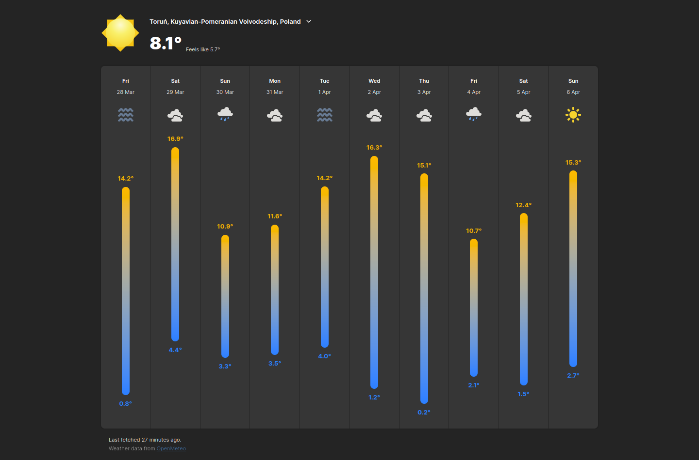
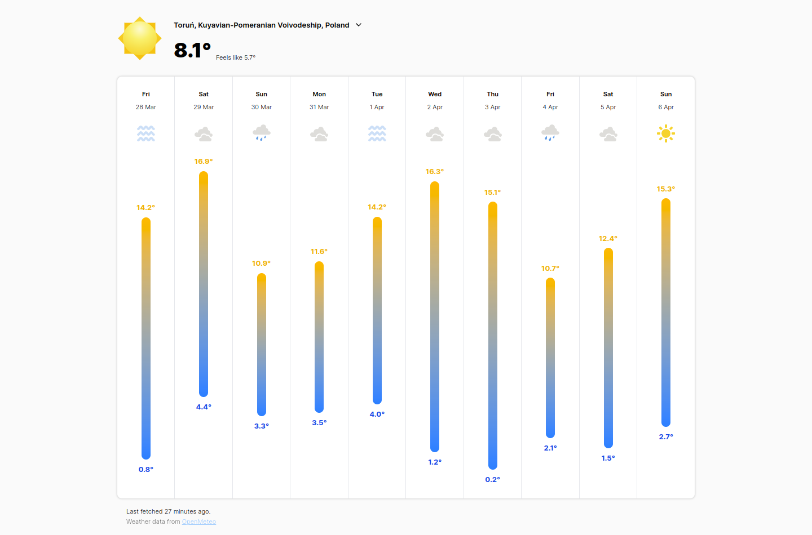

# [GNOME Weather](https://apps.gnome.org/Weather) App Clone
This is a clone of the [GNOME Weather](https://apps.gnome.org/Weather) App. It is a simple weather app that displays the current weather and forecast for the next 7 days. It uses the OpenWeatherMap API to get the weather data.

## Disclaimer (educational purposes only)
This project is for educational purposes only. It was made as a result of a school project. I am not affiliated with GNOME or OpenWeatherMap in any way.

## Disclaimer 2 (Licenses)
This project uses icons from [GNOME Weather](https://apps.gnome.org/Weather), licensed under GPLv2.

## APIs
> [!IMPORTANT]  
> I am aware that I had pushed the Geoapify key to the repository. This project is for educational purposes only, and if the key stops working or gets rate limited, then it is not my fault.
- OpenMeteo API (https://open-meteo.com/) - Weather data
- Geoapify API (https://www.geoapify.com/) - Reverse and forward geocoding

## Screenshots

Dark Theme

Light Theme

